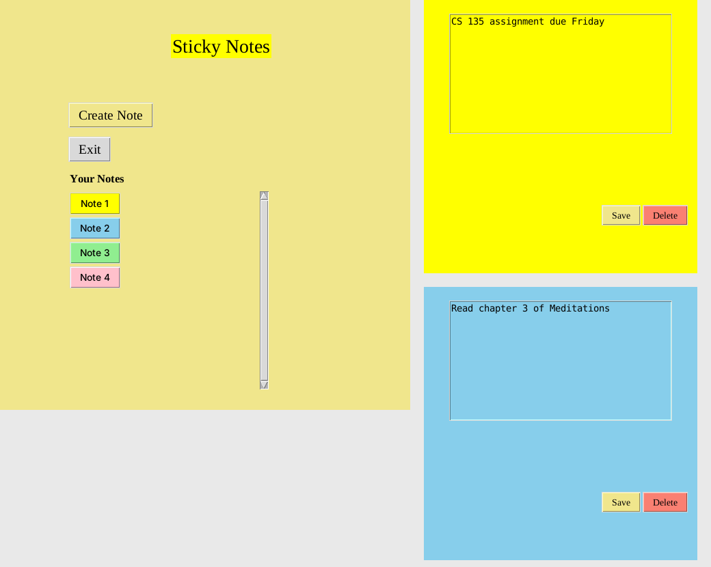

# Sticky Notes

A sticky-notes app in Python, built twice: first as a command-line app, then as a desktop app with Tkinter. Notes are saved locally as JSON and come back the next time you open the app.



## Desktop app (`GUI Version/`)

Built with Tkinter and organised into two classes: `NotesApp` (the main window) and `StickyNote` (one note window plus its button in the list).

- Create a note and pick one of five colours
- Each note opens in its own window with **Save** and **Delete**
- Closing a note hides it rather than deleting it, and it stays in the **Your Notes** list to reopen
- Scrollable notes list, with mouse-wheel scrolling
- Everything is saved automatically when you close a note or exit, and reloaded on start-up

```bash
cd "GUI Version"
python Sticky_notes.py
```

Notes are saved to `sticky_notes_data.json` next to the script:

```json
{
  "1": { "colour": "yellow", "text": "CS 135 assignment due Friday" },
  "2": { "colour": "skyblue", "text": "Read chapter 3 of Meditations" }
}
```

## Command-line app (`CLI version/`)

The first version. A menu-driven app that adds, views, edits and deletes titled notes, with the logic split into `notes_functions.py`.

```bash
cd "CLI version"
python notes.py
```

```
========= NOTES APP =========

1. Add Note
2. View Notes
3. Edit Note
4. Delete Note
5. Exit
```

Notes are saved to `notes.json` in the same folder.

## Requirements

Python 3 only. Tkinter ships with the standard Python installers for Windows and macOS. On Linux you may need to install it, for example `sudo apt install python3-tk`.

## Project structure

```
.
├── GUI Version/
│   └── Sticky_notes.py      # Tkinter desktop app
├── CLI version/
│   ├── notes.py             # Menu loop
│   └── notes_functions.py   # Add / view / edit / delete
├── docs/                    # README images
└── README.md
```

## Ideas for next steps

- Search across notes
- Pin important notes to the top
- Dark mode and custom colours
- Reminders
